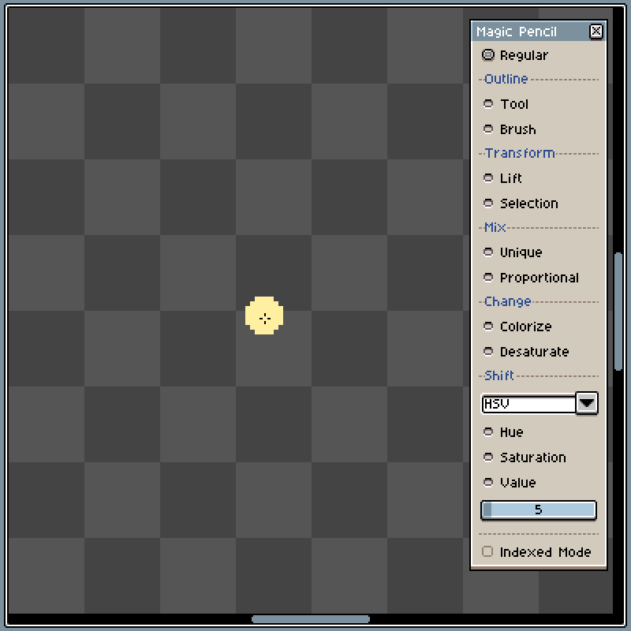
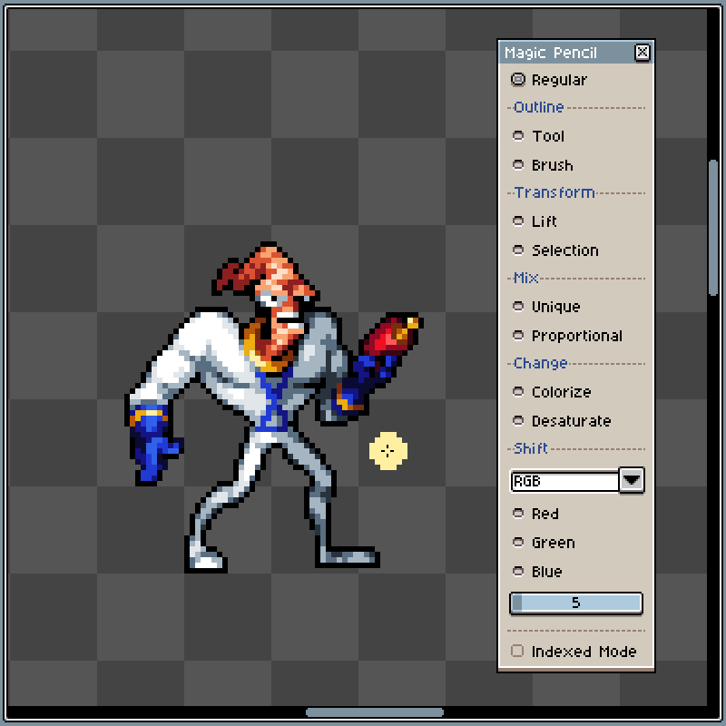
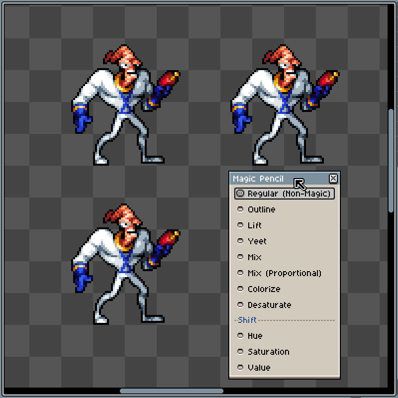
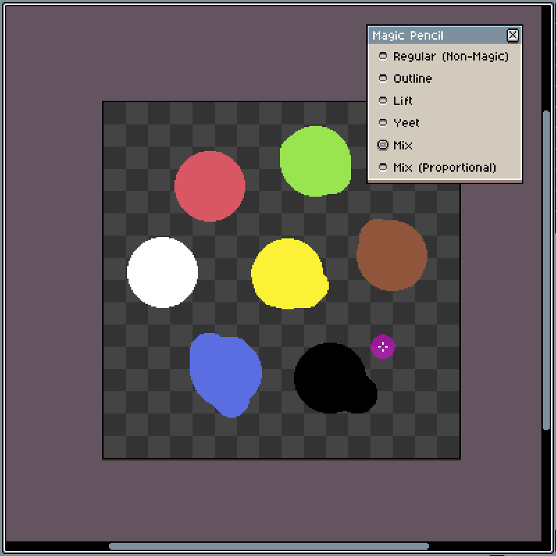
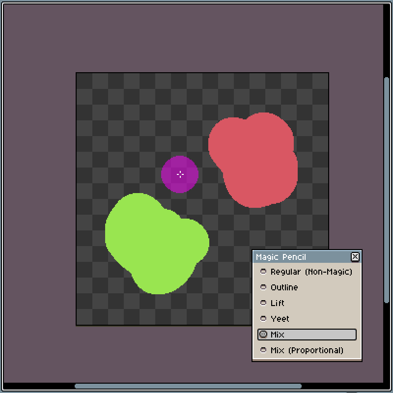

# Magic Pencil

**Magic Pencil** 是 Aseprite 的扩展，它为铅笔工具提供了额外的选项。

## How to use the extension

转到“编辑”菜单并单击“魔术铅笔”选项，从对话框窗口中选择一种效果并使用铅笔工具。

请注意，大多数选项使用魔术颜色，关闭魔术铅笔对话框窗口或选择常规选项后将恢复所选颜色。

## Options

- 轮廓生成(Outline)
  - 封闭图形(Tool)-在您单击的闭合形状周围添加轮廓，适用于前景（左键单击）和背景（右键单击）颜色。
  - 跟随笔刷(Brush)-绘制时在画笔周围添加轮廓。选择此选项后，可以在对话框窗口中的此选项下更改轮廓的颜色。

- 上移(Lift) -将图像的一部分移动到自己的图层中。

- 混合方式(Mix)
  - 唯一(Unique)- 混合颜色，左键单击使用 RGB 颜色模型混合颜色，而右键单击使用 HSV。

  - 成比(Proportional)- 混合颜色考虑到每种颜色的像素数，左键单击使用 RGB 颜色模型混合颜色，而右键单击使用 HSV。

- 鲜艳化(Colorize) - 更改颜色（色调），适用于前景（左键单击）和背景（右键单击）颜色。

- 去饱和(Desaturate) - 完全去除颜色（色调）。

- 转变(Shift)**Hue/Saturation/Value/Lightness** - 根据所选属性更改颜色，左键单击添加，右键单击减去。您可以通过更改这些选项下的百分比滑块来更改将应用​​多少次。

- 索引模式(Indexed Mode) - 启用后，防止引入新颜色，并且任何修改颜色的选项都将使用调色板中的颜色。

## 已知的问题

在完全空的单元格上使用 Magic Pencil 中的任何选项将导致第一个笔划被视为普通铅笔 当使用除 Outline 或 Colorize 之外的 Magic Pencil 中的任何选项（实际上使用所选颜色）时，从调色板中选择颜色会干扰其工作并导致奇怪的行为

## 预览

