# 主题偏好
**Theme Preferences**是[Aseprite](https://www.aseprite.org/)的一个扩展，可以在编辑器中定制主题。

## 如何使用该扩展
在安装了该扩展并重新启动 Aseprite 后，在 "视图 "菜单中会出现一个新的选项 "主题偏好"。

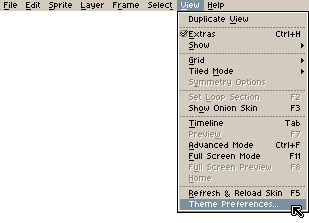

点击它将打开 "主题偏好"，允许你直接改变用户界面元素的颜色。

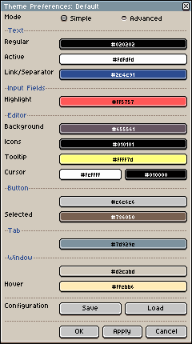
 ## 警告
 主题偏好需要访问它自己文件夹中的 PNG 和 XML 模板，以便定制主题。Aseprite 会提示你对扩展程序访问文件的明确许可。

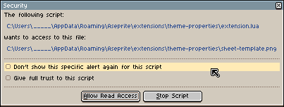 

如果你觉得不安全，你可以拒绝这个请求并阻止这个脚本。

## 保存和加载配置 你的主题偏好可以在这个窗口中保存和加载。

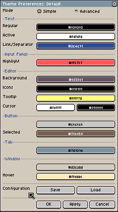 

## 导入和导出配置 
你的主题偏好可以导出为纯文本，以及网络安全代码，以便备份和与他人分享。
代码可以通过打开加载窗口并点击导入按钮来导入。任何保存的配置都有一个导出按钮，可以生成代码。
 

## 预览
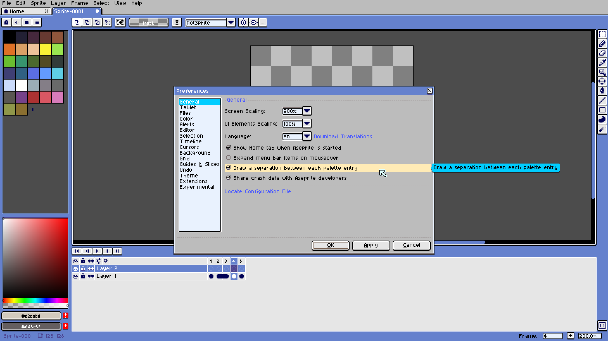 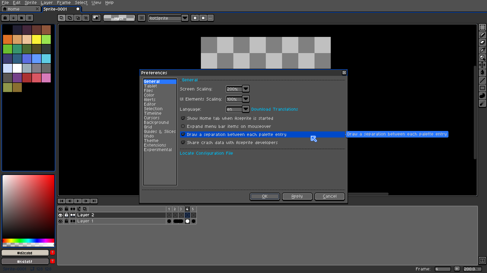 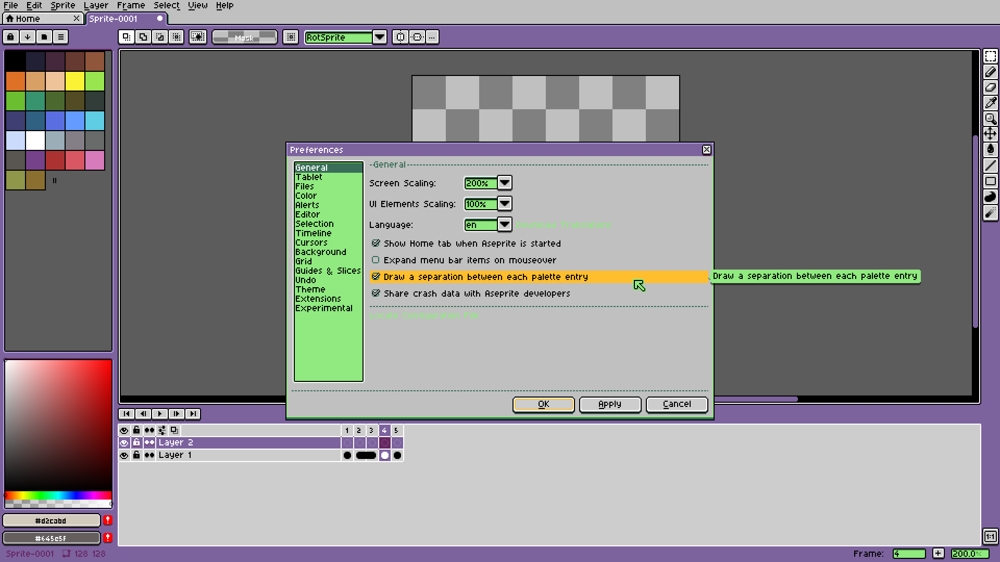 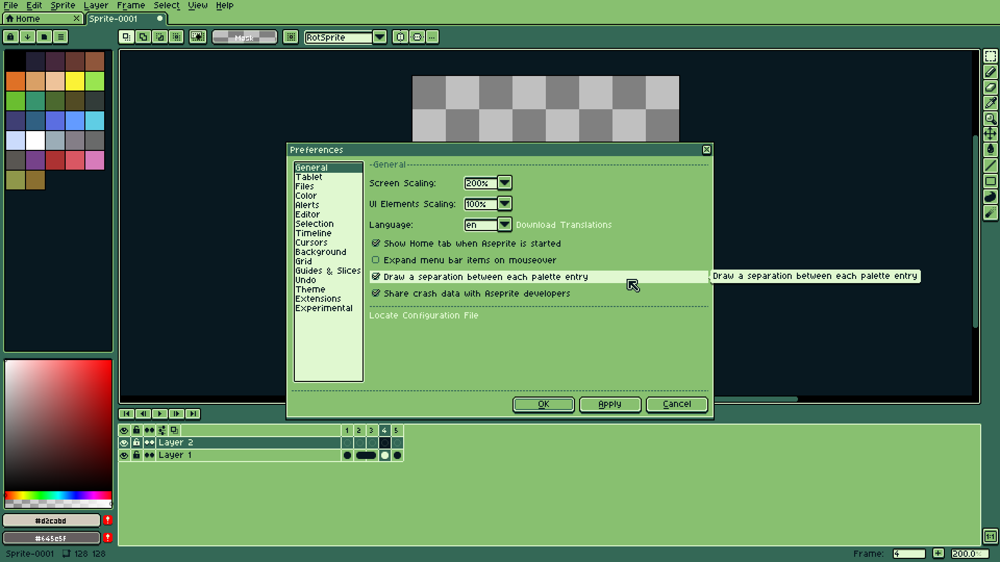 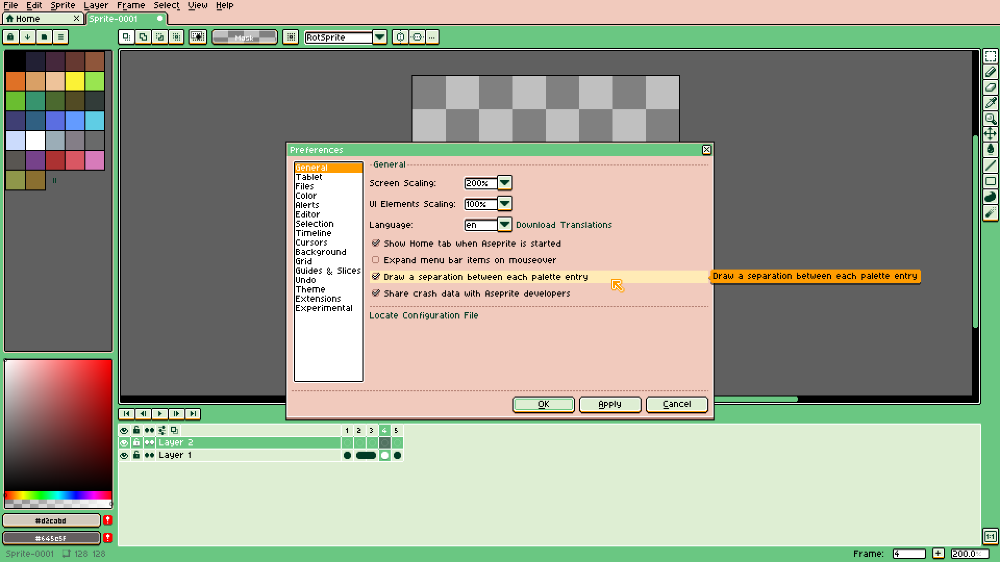 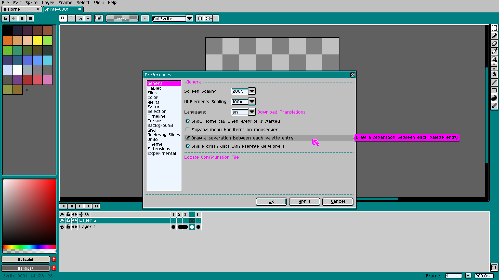 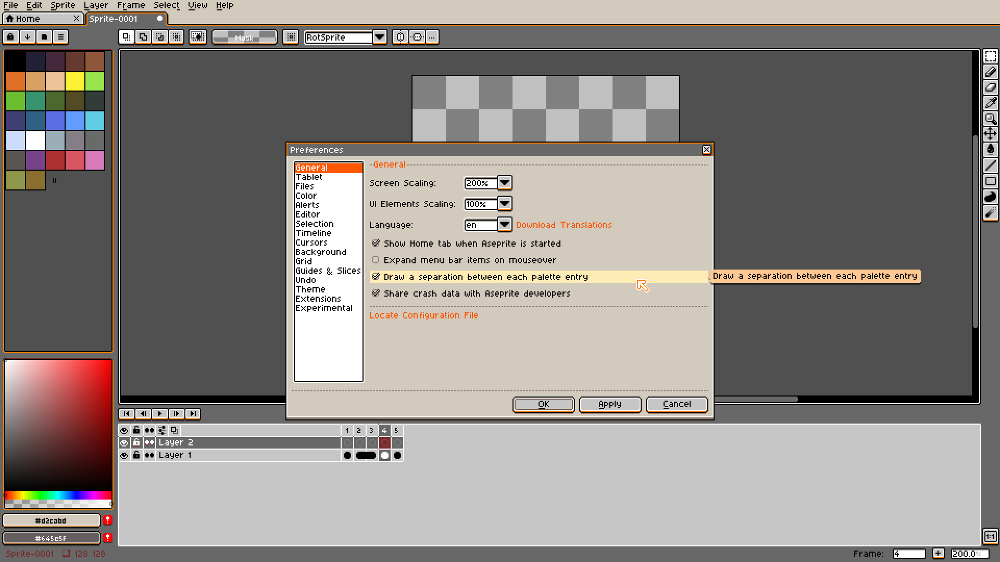 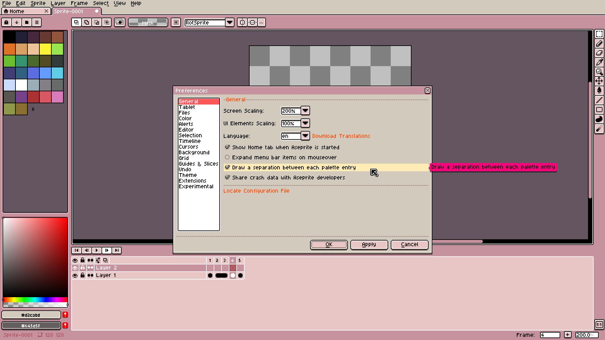 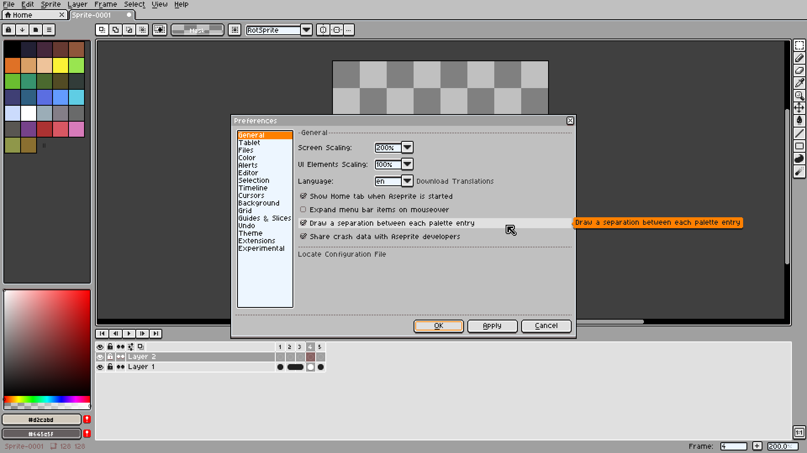 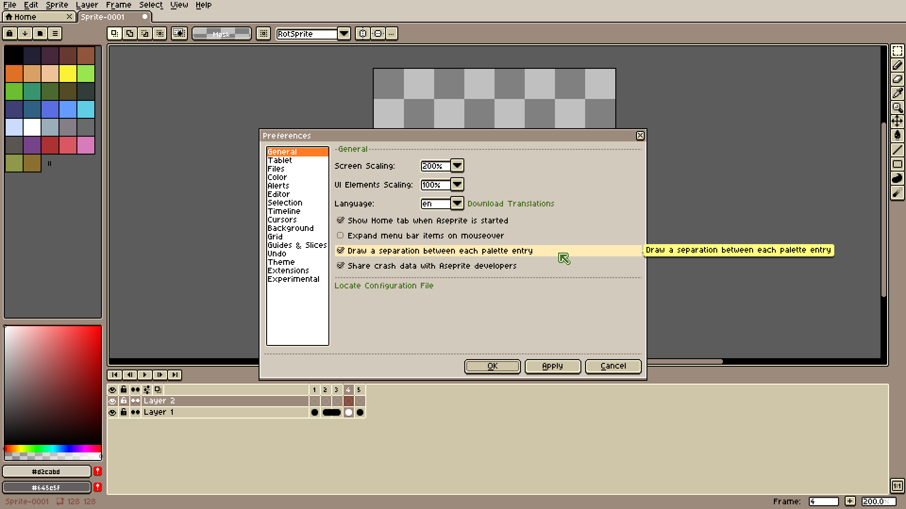
